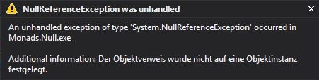
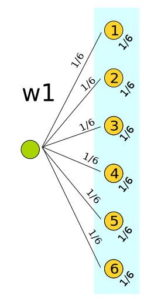
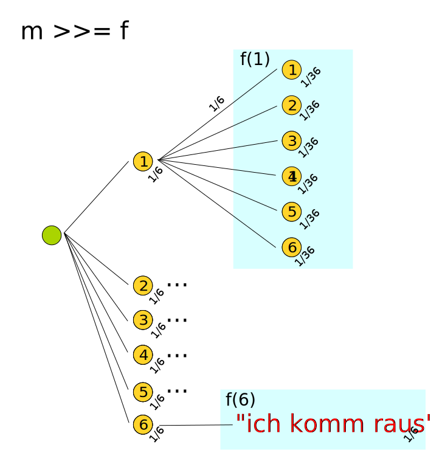
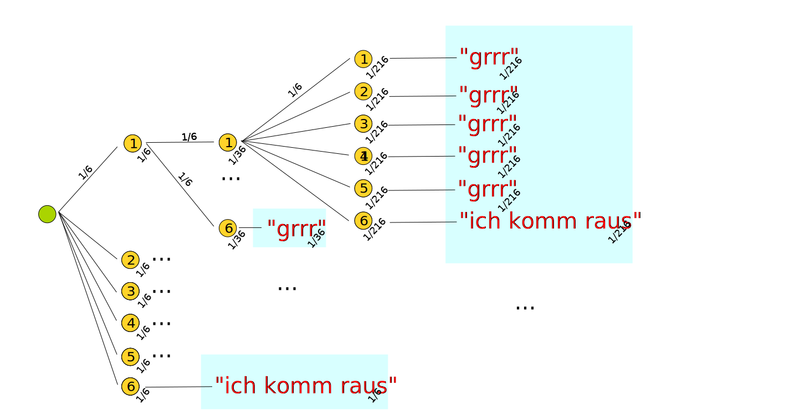

% Monaden
% Carsten König
% [https://carstenkoenig.github.io/DWX2014_Monaden](https://carstenkoenig.github.io/DWX2014_Monaden)

# Monade ... was ist das?

##


. . . 

... aber *wen* interessiert das?

## Es geht um: *Syntax*
C\#
```cs
IEnumerable<Outfit> Outfits()
{
    return
        from schuhe in Schuhe
        from hose in Hosen
        from hemd in Hemden
        select new Outfit {Schuhe = schuhe, Hose = hose, Hemd = hemd};
}
```

. . .

**Monade:** `IEnumerable`

## Es geht um: *DSL*s
F\#
```fsharp
let fetchAsync(url:string) : Async<string> =
    async { 
        try
            let uri = new System.Uri(url)
            let webClient = new WebClient()
            return! webClient.AsyncDownloadString(uri)
        with
            | ex -> printfn "Fehler: %s" ex.Message
    }
```

. . .

**Monade:** `Async`

## Es geht um: *Kapselung*
Haskell
```haskell
main :: IO ()
main = putStrLn "Hello, World!"
```

. . .

**Monade:** `IO`

# Motivation

## NullReferenceException



##

> I call it my billion-dollar mistake.

](images/Tony_Hoare.jpg)

## Guards

```cs
var customer = GetCustomer(5);
if (customer != null) 
{
  var orders = GetOrdersFor(customer);
  if (orders != null) 
  {
    // ...
  }
}
return null; // good idea isn't it?
``` 

## ein Muster...

```cs
var customer = GetCustomer(5);
if (customer != null) 
{
  var orders = GetOrdersFor(customer);
  if (orders != null) 
  { /* ... */ } 
  else 
    return null;
} 
else 
  return null; 
``` 

## refactor
```cs
public tR Guard<tS, tR>(tS source, Func<tS, tR> f)
  where tS : class
  where tR : class
{
  if (source != null) return f(source);
  else return null;
}
```
. . .
```cs
return Guard(GetCustomer(5), customer =>
  Guard(GetOrdersFor(customer), order => {
    // ...
  }));
``` 

## syntactic sugar
```cs
public static tR Guard<tS, tR>(this tS source, Func<tS, tR> f)
  where tS : class
  where tR : class
{
  if (source != null) return f(source);
  else return null;
}
```
<div class="notes">
Wenn der innere Block den Rückgabetyp nicht eindeutig bestimmt benötigt der Compiler Hilfe!
Z.B. `return (object)null;` statt `return null;`
</div>
. . .
```cs
return GetCustomer(5).Guard(customer =>
  GetOrdersFor(customer).Guard(order => {
    // ...
  }));
```

## können wir das eleganter lösen?

. . .

**C#** bekommt demnächst wahrscheinlich ein *monadic null checking*

```cs
GetCustomer(5)?.Orders()?. ...
```

# Maybe

##


```cs
Customer GetCustomer(int customerNumber)
``` 

Wenn eine Funktion **partiell** ist, dann sollte sie es auch *zugeben*

##

*Sag es im Namen*

```cs
Customer TryGetCustomer(int customerNumber)
``` 

. . .

**aber:** davon *merkt* der Compiler nichts

##

*Try/Can Pattern*

```cs
bool TryGetCustomer(int customerNumber, out Customer customer)
``` 

. . .

**Aber:** *imperatives* Handling

## Typen - was sonst?

```cs
Maybe<Customer> TryGetCustomer(int customerNumber)
``` 

```fsharp
type Maybe<'a> =
  | Just of 'a
  | Nothing
```

*Hinweis:* tatsächlich würde man F\# `Option<'a>` verwenden

für C\# gibt es schöne Hilfsmittel in [FSharpx.Core](https://www.nuget.org/packages/FSharpx.Core/)

## don't look so different

```cs
var customer = TryGetCustomer(5);
if (customer.IsJust)
{
    var orders = TryGetOrdersFor(customer.Value);
    if (orders.IsJust)
    { /* ... berechne irgendwas vom Typ Rückgabe */ }
    else
        return Maybe.Nothing<Rückgabe>();
}
else
    return Maybe.Nothing<Rückgabe>();
```

## refactor (again)

```cs
return Bind(TryGetCustomer(5), customer =>
  Bind(TryGetOrdersFor(customer), order => {
    // ...
  }));
``` 

## Bind

```cs
Maybe<tR> Bind<tS, tR>(Maybe<tS> source, Func<tS, Maybe<tR>> f)
```

. . .

```cs
{
  if (source.IsNothing) return Maybe.Nothing<tR>();
```

. . .

```cs
  else return f(source.Value);
}
```

## Sugar ... more Sugar


## C\#: LINQ

```cs
return
from customer in TryGetCustomer(5)
from orders in TryGetOrdersFor(customer)
select ...
```

## F\#: Computation Expressions

```fsharp
maybe {
    let! customer = tryGetCustomer 5
    let! orders   = tryGetOrders customer
    return ...
}
```

## Haskell: Do-Notation

```haskell
beispiel :: Maybe Orders
beispiel = do
  customer <- tryGetCustomer 5
  orders   <- tryGetOrdersFor customer
  return orders
```

## was müssen wir dafür tun?

## LINQ
`SelectMany` implementieren:

```cs
public static Maybe<tR> SelectMany<tS, tR>
  (this Maybe<tS> source, Func<tS, Maybe<tR>> selector)
{
    return Bind(source, selector);
}
```

## LINQ
nochmal `SelectMany`:

```cs
public static Maybe<tR> SelectMany<tS, tCol, tR>
  (this Maybe<tS> source, 
   Func<tS, Maybe<tCol>> collectionSelector, 
   Func<tS, tCol, tR> resultSelector)
{
    if (source.IsNothing) return Nothing<tR>();
    var col = collectionSelector(source.Value);
    if (col.IsNothing) return Nothing<tR>();
    return resultSelector(source.Value, col.Value);
}
```

im wesentlichen `Bind` + `Tranformation`/`Select`

## F\#
*Builder* implementieren:

```fsharp
type MaybeBuilder() =
    member x.Bind(m, f)    = bind m f
    member x.Return(v)     = Just v

let maybe = MaybeBuilder()
```

## Haskell
`Monad` Typklasse instanzieren:

```haskell
instance Monad Maybe where
  return = Just
  Nothing >>= _ = Nothing
  Just a  >>= f = f a
```


# List Monad

## Ziel
nicht-deterministische Ergebnise repräsentieren

. . . 

**oder einfach**

arbeiten mit Funktionen, die *mehrere mögliche Ergebnisse* haben können

## was ist zu tun?

Listen `[a]` sollen zum Monaden werden 

. . .

Gesucht: Implementation von

```haskell
(>>=) :: [a] -> (a -> [b]) -> [b]
```
und
```haskell
return :: a -> [a]
```

## Return

```haskell
return :: a -> [a]
```

**Intuition:** einen Wert in eine Liste **packen**

## Return

Haskell:
```haskell
return :: a -> [a]
return x = [x]
```

F#:
```fsharp
let return (x : 'a) : 'a list = [x]
```

## Bind

```haskell
(>>=) :: [a] -> (a -> [b]) -> [b]
```

**Intuition:**

  - jedes Element gibt wieder eine Liste
  - zusammen also eine Liste von Listen
  - diese gilt es **plattzumachen**

## Bind

Haskell:
```haskell
(>>=) :: [a] -> (a -> [b]) -> [b]
xs (>>=) f = concatMap f xs
```

F#:
```fsharp
let bind (xs : 'a list) (f : 'a -> 'b list) : 'b list =
  xs |> List.collect f
```

## Beispiel

*Permutation* einer Liste/Aufzählung

**Rezept**:

 - Nimm ein Element `x` heraus
 - Nimm eine Permuation `xs` der restlichen Elemente
 - `x:xs` ist eine Permutation
 - Liste alle solchen Permuationen auf

## F\#

```fsharp
let ohne x =
    List.filter ((<>) x)

let rec permutationen = function
  | [] -> [[]]
  | xs -> [ for x in xs do
            let rest = xs |> ohne x
            for xs' in permutationen rest do
            yield (x::xs') ]
```

## Haskell

```haskell
import Data.List (delete)

perm :: (Eq a) => [a] -> [[a]]
perm [] = return []
perm xs = do
  x <- xs
  xs' <- perm $ delete x xs
  return $ x:xs'
```

## C\#/LINQ

```cs
IEnumerable<IEnumerable<T>> Permuationen<T>(IEnumerable<T> items)
{
    if (!items.Any()) return new[] {new T[] {}};

    return
        from h in items
        from t in Permuationen(items.Where(x => !Equals(x, h)))
        select h.Vor(t);
}
```

## C\#/LINQ

**Hilfsfunktion**

```cs
IEnumerable<T> Vor<T>(this T value, IEnumerable<T> rest)
{
    yield return value;
    foreach (var v in rest)
        yield return v;
}
```


<div class="notes">
**Beachte:**
es gibt keine passende Einschränkung für a um hier `!=` zu verwenden,
deshalb wird Equals verwendet
</div>

# Wahrscheinlichkeiten

## inspieriert durch

](images/funpearlProp.jpg)

## Risiko

```fsharp
let ``Verluste beim Risiko (3 gegen 2)`` =
    vert {
        let! offensive = nWürfel 3
        let! defensive = nWürfel 2
        let defensivVerluste = 
            List.zip (offensive |> List.sort |> List.tail)
                     (defensive |> List.sort)
            |> List.sumBy (fun (o,d) -> if d >= o then 0 else 1)
        return sprintf "%d:%d" (2-defensivVerluste) defensivVerluste
    } |> printVerteilung
```

. . .

```fsharp
> 
"0:2": 37.17%
"1:1": 33.58%
"2:0": 29.26%
```

## Darstellung

Eigentlich nur die *List*-Monade mit Wahrscheinlichkeiten

```fsharp
type Wahrscheinlichkeit = double
type Verteilung<'a> = ('a * Wahrscheinlichkeit) list
```

## Return

Entspricht dem **sicheren Ereignis**

```fsharp
let sicher (a : 'a) : Verteilung<'a> =
    [a, 1.0]

let returnM (a : 'a) : Verteilung<'a> =
  sicher a
```

## Bind

folge einem dynamisch erzeugten [*Baumdiagramm*](https://de.wikipedia.org/wiki/Baumdiagramm) 
und multipliziere die Wahrscheinlichkeiten.

## Beispiel

```fsharp
let ``Mensch ärgere dich (nicht?)`` =
    vert {
        let! w1 = würfel
        if w1 = 6 then return "ich komm raus" else
        let! w2 = würfel
        if w2 = 6 then return "ich komm raus" else
        let! w3 = würfel
        if w3 = 6 then return "ich komm raus" else
        return "grrr"
    }
```

. . .

```fsharp
val ( Mensch ärgere dich (nicht?) ) : Verteilung<string> =
  [("grrrr", 0.5787037037); ("ich komm raus", 0.4212962963)]
```


## Baumdiagramm



## Baumdiagramm



## Baumdiagramm



## Bind

```fsharp
let bind (v : Verteilung<'a>) (f : 'a -> Verteilung<'b>) 
         : Verteilung<'b> =
    [ for (a,p) in v do
      for (b,p') in f a do
      yield (b, p*p')
    ] |> normalize
```

## Detail

`normalize` fasst nur die Ergebnise additiv zusammen

```fsharp
let normalize (v : Verteilung<'a>) =
    let dict = new System.Collections.Generic.Dictionary<_,_>()
    let get a = if dict.ContainsKey a then dict.[a] else 0.0
    let add (a,p) = dict.[a] <- get a + p
    v |> List.iter add
    dict |> Seq.map (fun kvp -> (kvp.Key, kvp.Value)) 
         |> List.ofSeq
```

# FsCheck Generator

## FsCheck?
- Testet **Eigenschaften** von Funktionen/Programmen automatisch.
- Eigenschaft: `prop : 'input -> bool`
- FsCheck generiert zufällige Eingaben und testet ob die Eigenschaft jeweils `true` liefert.

[Doku/Info https://fsharp.github.io/FsCheck/QuickStart.html](https://fsharp.github.io/FsCheck/QuickStart.html)

## Beispiel
```fsharp
let ``zweimal List.rev ist Identität``(xs : int list) =
    List.rev (List.rev xs) = xs

Check.Quick ``zweimal List.rev ist Identität``
> Ok, passed 100 tests.
```

```fsharp
let ``List.rev ist Identität``(xs : int list) =
    List.rev xs = xs

Check.Quick ``List.rev ist Identität``
> Falsifiable, after 3 tests (6 shrinks) (StdGen (1233601158,295877135)):
> [1; 0]
```

## Generatoren
Um die Testfälle zu generieren verwendet FsCheck *Generatoren*

```fsharp
type Würfel = internal W of int
let würfel n = 
    if n < 1 || n > 6 
    then failwith "ungültiger Wert"
    else W n

let würfelGen =
    gen {
        let! n = Gen.choose (1,6)
        return würfel n
    }
```

## Definition
*vereinfacht:* Generator ist eine Aktion, die einen zufälligen Wert liefert

```fsharp
type Gen<'a> = Gen of (unit -> 'a)

let sample (Gen g : Gen<'a>) : 'a =
    g()
```

## make it monadic

Gesucht: Implementation von

```fsharp
bind : Gen<'a> -> ('a -> Gen<'b>) -> Gen<'b>
```
und
```fsharp
return : 'a -> Gen<'a>
```

## Return

```fsharp
return : 'a -> Gen<'a> = 'a -> (unit -> 'a)
```

Intuition: zufällige Wahl aus einem Element ...

. . . 

```fsharp
let returnM (a : 'a) : Gen<'a> =
    Gen <| fun () -> a
```

## Bind

```fsharp
Gen<'a> -> ('a -> Gen<'b>) -> Gen<'b> =
(unit -> 'a) -> ('a -> (unit -> 'b)) -> (unit -> 'b)
```

. . .

F#:
```fsharp
let bind (m : Gen<'a>) (f : 'a -> Gen<'b>) : Gen<'b> =
    Gen <| fun () -> sample (sample m |> f)
```

<div class="notes">
**Beachte:**
eine Eta-Reduktion geht in die Hose, weil der Scheiß nicht
rein genug ist
</div>

# Async

## MSDN example

```fsharp
let fetchAsync(name, url:string) =
    async { 
        try
            let uri = new System.Uri(url)
            let webClient = new WebClient()
            let! html = webClient.AsyncDownloadString(uri)
            printfn "Read %d characters for %s" html.Length name
        with
            | ex -> printfn "%s" (ex.Message);
    }
```

## simplify

verkettete Continuations/Callback

## Continuation

```fsharp
type Cont<'a>  = 'a -> unit 
```

 - Nebeneffekt behaftete Aktion
 - wird mit dem Ergebnis einer (asynchronen) Berechnung aufgerufen

## Continuation monad

```fsharp
type ContM<'a> = { run : Cont<'a> -> unit }

let mkCont (f : Cont<'a> -> unit) : ContM<'a> = 
    { run = f }    
```
- gib mir eine `'a ` Continution `c`
- ich berechne ein `'a ` und rufe `c ` damit auf
- kann verzögert/asychron erfolgen

## Beispiel

```fsharp
let delay (span : TimeSpan) : ContM<unit> =
fun f ->
    let timer = new Timer()
    timer.Interval <- int span.TotalMilliseconds
    timer.Tick.Add (fun _ -> timer.Dispose(); f())
    timer.Start()
|> mkCont
```

## make it monadic

```fsharp
let returnM : 'a -> ContM<'a> = ...

let bind : ContM<'a> -> ('a -> ContM<'b>) -> ContM<'b> =
```

## Return

```fsharp
let returnM (a : 'a) : ContM<'a> =
    mkCont (fun f -> f a)
```

rufe die übergebene Continuation sofort mit `a` auf

## Bind

```fsharp
let bind : ContM<'a> -> ('a -> ContM<'b>) -> ContM<'b> =
```

. . .

```fsharp
=  (('a -> unit) -> unit) 
-> ('a -> (('b -> unit) -> unit)) 
-> (('b -> unit) -> unit)
``` 
 
. . .


## let the TYPES guide you luke


## Bind

```fsharp
let bind (f : 'a -> ContM<'b>) (m : ContM<'a>) : ContM<'b> =
  fun (c : Cont<'b>) ->
      m.run <| fun a -> (f a).run c
  |> mkCont
```

. . . 

wenn eine Continuation `c ` übergeben wird:

- berechne erst den Effekt von `m `
- nutze dessen Ergebnis um mit `f ` ein `Cont<'b> ` zu bekommen
- berechne diese und gib das Ergebnis an `c ` weiter

## example

```fsharp
let runWith (f : 'a -> 'b) (m : ContM<'a>) = 
    m.run (f >> ignore)

let verzögertesHallo() =
    cont {
       do! delay <| TimeSpan.FromSeconds 2.0
       return "Hello, World!"
    } |> runWith MessageBox.Show
```

# State

## Motivation
Berechnungen mit Zustand:
```haskell
f :: zustand -> a -> (b, zustand)
g :: zustand -> b -> (c, zustand)
```

. . . 

*Komposition*:
```haskell
let (b, z1) = f z0 a
let (c, _)  = g z1 b
c
```
unschön - geht das mit Monaden besser?

## to much freedom

```haskell
f :: zustand -> a -> (b, zustand)
```

- **Bisher:** immer ein generischer Parameter im Monaden
- **jetzt:**  drei: `zustand`, `a` und `b`

. . .

`zustand` *ändert* sich nicht - aber was ist mit den anderen?

## functional trickster

ein wenig umformen:

```haskell
f :: a -> (zustand -> (b, zustand))
```

hier ist ein Monade versteckt

. . . 

*Hint:* `putStrLn :: String -> IO ()`

## and the candiate is

Haskell:
```haskell
data State s a = MkState { runState :: s -> (a, s) }
```

F\#:
```fsharp
type State<'s,'a> = { runState : 's -> ('a*'s) }
let mkState f = { runState = f }
```

## make it monadic

```haskell
return :: a -> State s a
(>>=)  :: State s a -> (a -> State s b) -> State s b
```

## Return

Haskell:
```haskell
return :: a -> State s a
return a =  MkState $ \s -> (a, s)
```

F\#
```fsharp
let return (a : 'a) : State<'s, 'a> =
  mkState <| fun s -> (a, s)
```

reiche den Zustand weiter und gib den Wert zurück

## Bind

Haskell
```haskell
(>>=)  :: State s a -> (a -> State s b) -> State s b
State f >>= g = 
    MkState $ \s -> let (a,s') = f s 
                    in runState (g a) s'
```

F\#
```fsharp
let bind (g : 'a -> State<'s,'b>) (f : State<'s,'a>) : State<'s,'b> =
    fun s ->
        let (a,s') = f.runState s
        (g a).runState s'
    |> mkState
```

## Komposition

Problem war ja:

```haskell
f :: a -> (State s b)
g :: b -> (State s c)
```

gesucht Operator `op` mit

```haskell
f `op` g :: a -> (State s c)
```

## Implementation

Haskell:
```haskell
op :: (a -> State s b) -> (b -> State s c) -> (a -> State s c)
op f g = \a -> f a >>= g
```

F\#:
```fsharp
let op f g =
    fun a -> bind (f a) g
```

## Übrigens...

HLint:
```
Error: Use >=>
Found:
  \ a -> f a >>= g
Why not:
  f Control.Monad.>=> g
```

das ist die *Kleisli* Komposition für Monaden ...

. . . 

die ist in Haskell für alle Monaden definiert:

```haskell
(>=>) :: Monad m => (a -> m b) -> (b -> m c) -> (a -> m c)
f >=> g = \x -> f x >>= g
```

. . . 

in .NET ist das so leider nicht möglich

# § Gesetze §

## Monade sollte erfüllen:

1. **Links-Identität**: `return a >>= f === f a`
2. **Rechts-Identität**: `m >>= return === m`
3. **Assoziativität**: `(m >>= f) >>= g === m >>= (\x -> f x >>= g)`

## Warum?

rein *mathematisch* sind diese Gesetze unbedingt nötig um sich Monade zu nennen.

siehe etwa: [Category Theory & Programming](http://yogsototh.github.io/Category-Theory-Presentation/)

. . . 

*praktisch* normale Programmiererintuition

## Rechts-Identität

```haskell
m >>= return === m
```

. . .

als Liste
```haskell
[ y | x <- xs; y <- [x] ] === xs
```

. . .

LINQ / C\#

```cs
return
   from x in xs
   from y in new[]{x}
   select y;
```

sollte natürlich das Gleiche wie einfach

```cs
return xs;
```

sein.

## Links-Identität

```haskell
return a >>= f === f a
```

. . .

LINQ / C\#

```cs
return
   from x in new []{a}
   from y in f x
   select y;
```

sollte natürlich das Gleiche wie einfach

```cs
return f(a);
```

sein.

## Assoziativität (linke Seite)

```haskell
(m >>= f) >>= g === m >>= (\x -> f x >>= g)
```

LINQ / C\#

```cs
var zw1 =   
   from x in xs
   from y in f(x)
   select y;
return
   from y in zw1
   from z in g(y)
   select y;
```

## Assoziativität (rechte Seite)

```haskell
(m >>= f) >>= g === m >>= (\x -> f x >>= g)
```

LINQ / C\#

```cs
Func<X,IEnumerable<Z>> zw1 =
  x => from y in f(x)
       from z in g(y)
       return z;
return
  from x in xs
  from z in zw1(x)
  select z;  
```

## Assoziativität

oder einfach

LINQ / C\#

```cs
return
  from x in xs
  from y in f(x)
  from z in g(y)
  select z;  
```

## Assoziativität Kleisli

und mit *Kleisli*

```haskell
(f >=> g) >=> h === f >=> (g >=> h)
```
sieht es sogar wie **Assoziativität** aus!

<div class="notes">
**Hänge**
?print-pdf#/
an die URL im Browser an um eine PDF zu erzeugen
</div>